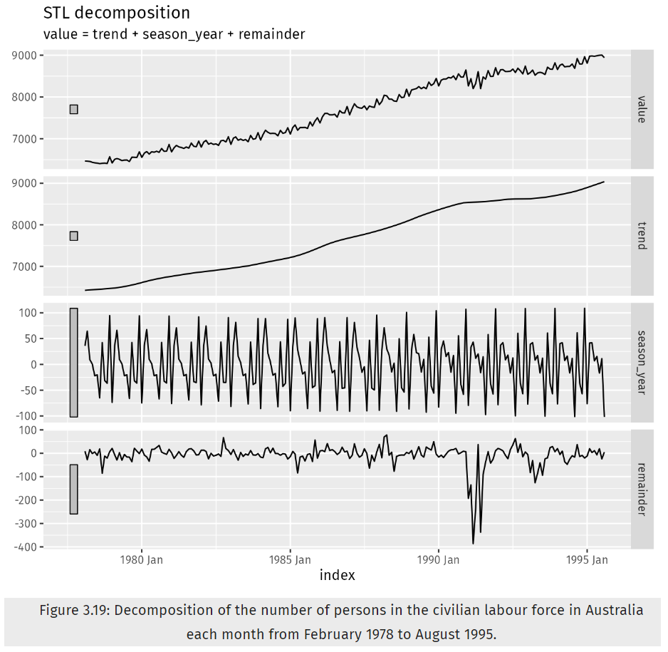
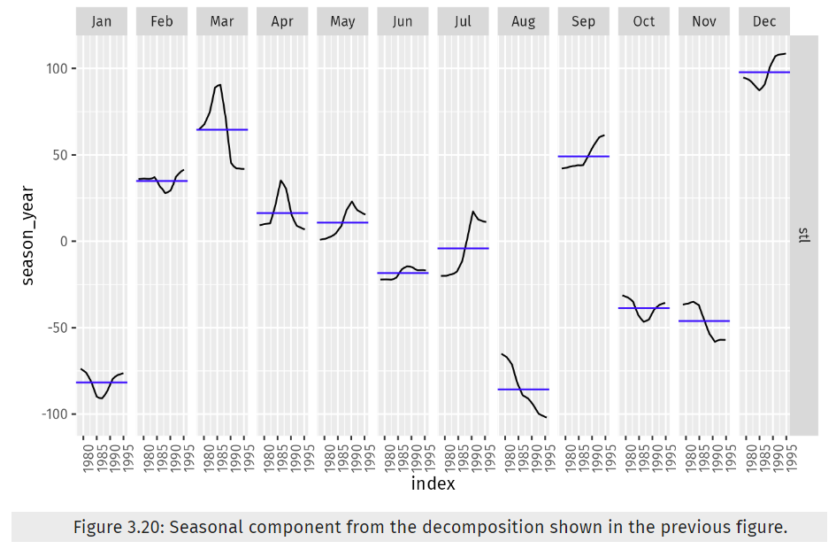

```{r, message=FALSE, warning=FALSE}
library('fpp3')
library('tsibble')
library('ggplot2')
library('readr')
library('zoo')
library('cowplot')
library('ggfortify')
library('gridExtra')
library('latex2exp')
library('seasonal')
```


# Instuctions

Do exercises 3.1, 3.2, 3.3, 3.4, 3.5, 3.7, 3.8 and 3.9 from the online Hyndman book.  Please include your Rpubs link along with.pdf file of your run code

# 3.1

## i 

  Consider the GDP information in `global_economy`. Plot the GDP per capita for each country over time. Which country has the highest GDP per capita? 

```{r}

# global_economy

```


```{r, message=FALSE, warning=FALSE}

# add GDP to the Data frame
global_economy <- global_economy %>%
  mutate(GDP_per_capita = GDP / Population)

# get the max values entire row for the title
max_gdp_row <- global_economy[which.max(global_economy$GDP_per_capita), ]


global_economy %>%
  autoplot(GDP_per_capita, show.legend = FALSE) +
  labs(title = paste("GDP per capita by Country | Max GDP:", max_gdp_row$GDP_per_capita, "for", max_gdp_row$Country, " in ",max_gdp_row$Year),
       y = "$US")


```

```{r, warning=FALSE}
na_cnt<-sum(is.na(global_economy%>%
        filter(Country=="Monaco")%>%
          select(GDP_per_capita)))


paste("In the date range of 1960 to 2017 Monaco has had ",na_cnt," NA's")
```

## ii

How has this changed over time?

```{r}

global_economy <- index_by(global_economy, Year)

# store only rows with max gdp
max_gdp_annual <- global_economy %>%
  slice_max(GDP_per_capita) %>%
  ungroup()

# plot by rows selected
ggplot(max_gdp_annual, aes(x = Year, y = GDP_per_capita, color = Country)) +
  geom_line() +
  labs(title = "Country with Highest GDP per Year",
       x = "Year",
       y = "GDP") +
  theme_minimal()
```
Looks like Luxembourg is using top in GDP making Monaco's 2014 GDP 

# 3.2

For each of the following series, make a graph of the data. If transforming seems appropriate, do so and describe the effect.

# i

United States `GDP from global_economy`.

Using GDP per Capita made the most sense. It was already transformed by the above manipulations.

```{r}

fig1<-global_economy%>%
  filter(Country=="United States")%>%
    autoplot()+
  labs(title = "GDP US")

fig2<-global_economy%>%
  filter(Country=="United States")%>%
    autoplot(GDP_per_capita)+
  labs(title = "GDP per Capita US")

plot_grid(fig1,
          fig2, nrow = 1)

```


# ii

Slaughter of Victorian “Bulls, bullocks and steers” in `aus_livestock`.

The data seemed clutter. By grouping it by Quarter the visual is clearer and the initial dip is apparent.

```{r}
head(aus_livestock)
```


```{r}

fig3 <- aus_livestock %>%
  filter(Animal == "Bulls, bullocks and steers") %>%
  summarise(Count = sum(Count)) %>%
  autoplot(show.legend=FALSE)

fig4 <- aus_livestock %>%
  filter(Animal == "Bulls, bullocks and steers") %>%
  mutate(Quarter = yearquarter(Month)) %>%
  index_by(Quarter) %>%
  summarise(Count = sum(Count)) %>%
  autoplot(Count, show.legend=FALSE)

plot_grid(fig3, fig4, nrow = 1)

```


# iii

Victorian Electricity Demand from `vic_elec`.

This was a lot of data so dealers choice, but viewing the annual data in a weekly and monthly basis shows an initial spike the first week and month for the year.

```{r}
head(vic_elec)
```

```{r}
fig5<-vic_elec%>%
        autoplot(Demand)

fig6<-vic_elec%>%
  mutate(Week = yearweek(Time)) %>%
  index_by(Week) %>%
  summarise(Demand = sum(Demand)) %>%
  autoplot(Demand, show.legend=FALSE)

fig7<-vic_elec%>%
  mutate(Month = yearmonth(Time)) %>%
  index_by(Month) %>%
  summarise(Demand = sum(Demand)) %>%
  autoplot(Demand, show.legend=FALSE)

# fig7<-vic_elec%>%
#   mutate(Day = as.Date(Time)) %>%
#   group_by(Day) %>%
#   summarise(Demand = sum(Demand)) %>%
#   autoplot(Demand, show.legend=FALSE)

plot_grid(fig5,
          fig6,
          fig7, nrow = 2)
```


# iv

Gas production from `aus_production`.

```{r}

head(aus_production)

```

I played with all methods introduced in mathematical transformations considering the high variability between the start and end of the data, in an attempt to remove variability.

Than I applied 
*Box-Cox transformations:*

$w_t= \Biggl\{ \genfrac{}{}{0pt}{}{log(y_t),\ \ \ \lambda = 0}{ (sign(y_t)|y_t|^\lambda -1)/\lambda,\ \  \lambda \ne0}$

as explained in [3.1 video](https://youtu.be/Vp-L1zmspss?si=RsPlMtI83DtFIh2V&t=689) for transformations

```{r}
#example
# food |>
#   features(Turnover, features = guerrero())

(aus_gas_lambda<-aus_production%>%
  features(Gas, features = guerrero)%>%
   pull(lambda_guerrero))
```

```{r}

fig8 <- aus_production %>%
  autoplot(Gas) +
  labs(title = "Original")

# Define fig9
fig9 <- aus_production %>%
  autoplot(log(Gas)) +
  labs(title = expression(paste("Log Gas ", lambda, "= 0")))

# Define fig10
fig10 <- aus_production %>%
  autoplot(-1/Gas) +
  labs(title = "Inverse Gas")

fig11 <- aus_production%>%
          autoplot(box_cox(Gas,aus_gas_lambda))

plot_grid(fig8 +
            labs(title = "Original"), 
          fig9 +
            labs(title = expression(paste("Log Gas ",
                                          lambda, "= 0"))), 
          fig10 +
            labs(title = expression(paste("Inverse Gas ",
                                          lambda, "= 0"))),
          fig11 +
            labs(title = expression(paste("Box-Cox ",
                                          lambda,
                                          " = 0.1095171"))),
          nrow = 2)

```


# 3.3

Why is a Box-Cox transformation unhelpful for the `canadian_gas` data?

as per the [3.1 Video](https://youtu.be/Vp-L1zmspss?si=BtX-2TInfcuKjfc0&t=749) for transformations.

A low value of $\lambda$ can give extremely large prediction intervals
and as we see in the plot below does not do much for transformation.

```{r}
head(canadian_gas)
```
```{r}
(canada_gas_lambda<-canadian_gas%>%
    features(Volume, features = guerrero)%>%
    pull(lambda_guerrero)
)

```

```{r}
fig12<-canadian_gas%>%
  autoplot(Volume)

fig13<-canadian_gas%>%
  autoplot(box_cox(Volume, canada_gas_lambda))

plot_grid(fig12+labs(title = "Original"),
          fig13+labs(title = expression(paste("Box-Cox ",
                                              lambda,
                                              " =0.5767648"))))
```

```{r}
rm(list = ls(pattern = "^fig"))
```


# 3.4

What Box-Cox transformation would you select for your retail data (from Exercise 7 in Section [2.10](https://otexts.com/fpp3/graphics-exercises.html#graphics-exercises))?

I would rely on `features`=`guerrero` since its designed to be the best fit.

```{r}
# data provided
set.seed(123)
myseries <- aus_retail |>
  filter(`Series ID` == sample(aus_retail$`Series ID`,1))
head(myseries)
```

```{r}
(myseries_lambda <- myseries%>%
        features(Turnover,features = guerrero)%>%
          pull(lambda_guerrero))
```

```{r}
fig1 <- myseries%>%
          autoplot(Turnover)

fig2 <- myseries%>%
        autoplot(box_cox(Turnover,myseries_lambda))
fig2<-fig2+ylab("Turnover")

plot_grid(fig1+labs(title = "Original"),
          fig2+labs(title = paste("Box-cox λ =",myseries_lambda)), nrow=2)
```


# 3.5

For the following series, find an appropriate Box-Cox transformation in order to stabilize the variance. 

# i

Tobacco from `aus_production`

```{r,warning=FALSE}
aus_production_lambda<-aus_production%>%
  features(Tobacco,features=guerrero)%>%
  pull(lambda_guerrero)

aus_production%>%
  autoplot(box_cox(Tobacco,aus_production_lambda))+
  labs(title =paste("λ =",aus_production_lambda),ylab="" )
```


# ii 

Economy class passengers between Melbourne and Sydney from `ansett`

```{r}
head(ansett)
```


```{r,warning=FALSE}
ansett_lambda<-ansett%>%
  filter(Class=="Economy"& Airports=='MEL-SYD')%>%
  features(Passengers,features=guerrero)%>%
  pull(lambda_guerrero)

ansett%>%
  filter(Class=="Economy"& Airports=='MEL-SYD')%>%
  autoplot(box_cox(Passengers,ansett_lambda))+
  labs(title =paste("λ =",ansett_lambda), y=" " )
```

# iii

Pedestrian counts at Southern Cross Station from `pedestrian`.

```{r}
head(pedestrian)
```

```{r}
pedestrian_lambda<-pedestrian%>%
  filter(Sensor=="Southern Cross Station")%>%
  features(Count,features=guerrero)%>%
  pull(lambda_guerrero)

pedestrian%>%
  filter(Sensor=="Southern Cross Station")%>%
  autoplot(box_cox(Count,pedestrian_lambda))+
  coord_flip()+
  labs(title =paste("λ =",pedestrian_lambda),x = "Date (hourly)",
       y="Count" )
```


# 3.7

Consider the last five years of the Gas data from `aus_production`.

```{r}
gas <- tail(aus_production, 5*4) |> select(Gas)

head(gas)
```

# a.

Plot the time series. Can you identify seasonal fluctuations and/or a trend-cycle?

*Looks like the trend from 2006-2010 is upwards. Seasonality is the high every 3rd quarter and low every 1rst Quarter*

```{r}
gas%>%
  autoplot(Gas)
```


# b.

Use `classical_decomposition` with `type=multiplicative` to calculate the trend-cycle and seasonal indices.

Ref [3.4 video](https://youtu.be/1lj_hJBGg3A?si=Tupb9aKAtjbpff03&t=399)

```{r}
#example
# us_retail_employment |>
#   model(classical_decomposition(Employed, type = "additive")) |>
#   components()|>
#   autoplot()+xlab("Year")+
#   ggtitle("Classical additive decomposition of total US retail employment")
```

```{r, warning=FALSE}
gas%>%
  model(classical_decomposition(Gas,type= "multiplicative"))%>%
  components()%>%
  autoplot+xlab("")
```


# c.

Do the results support the graphical interpretation from part a?

*The results show a positive trend with quarterly seasonality so yes it does.*

# d.

Compute and plot the seasonally adjusted data.

As shown in 3.5

```{r}
#Example
# x11_dcmp |>
#   ggplot(aes(x = Month)) +
#   geom_line(aes(y = Employed, colour = "Data")) +
#   geom_line(aes(y = season_adjust,
#                 colour = "Seasonally Adjusted")) +
#   geom_line(aes(y = trend, colour = "Trend")) +
#   labs(y = "Persons (thousands)",
#        title = "Total employment in US retail") +
#   scale_colour_manual(
#     values = c("gray", "#0072B2", "#D55E00"),
#     breaks = c("Data", "Seasonally Adjusted", "Trend")
#   )

```

```{r, warning=FALSE}

gas%>%
  model(classical_decomposition(Gas,type= "multiplicative"))%>%
  components()%>%
  ggplot(aes(x = Quarter)) +
  geom_line(aes(y = Gas, colour = "Data")) +
  geom_line(aes(y = season_adjust,
                colour = "Seasonally Adjusted")) +
  geom_line(aes(y = trend, colour = "Trend")) +
  labs(y = "Gas count in PJ",
       title = "Australian Gas Production") +
  scale_colour_manual(
    values = c("gray", "#0072B2", "#D55E00"),
    breaks = c("Data", "Seasonally Adjusted", "Trend")
  )

```


# e.

Change one observation to be an outlier (e.g., add 300 to one observation), and recompute the seasonally adjusted data. What is the effect of the outlier?

```{r}
rm(list = ls(pattern = "^fig"))
```


```{r}
print(nrow(gas))
```


```{r}
gas_begin_edit <- gas
gas_end_edit <- gas
gas_begin_edit$Gas[1] <- gas_begin_edit$Gas[10] + 300
gas_end_edit$Gas[20] <- gas_begin_edit$Gas[10] + 300
```

```{r}

fig1<-gas_begin_edit%>%
  model(classical_decomposition(Gas,type= "multiplicative"))%>%
  components()%>%
  ggplot(aes(x = Quarter)) +
  geom_line(aes(y = Gas, colour = "Data")) +
  geom_line(aes(y = season_adjust,
                colour = "Seasonally Adjusted")) +
  geom_line(aes(y = trend, colour = "Trend")) +
  labs(y = "Gas count in PJ",
       title = "Australian Gas Production") +
  scale_colour_manual(
    values = c("gray", "#0072B2", "#D55E00"),
    breaks = c("Data", "Seasonally Adjusted", "Trend")
  )

fig2<-gas_end_edit%>%
  model(classical_decomposition(Gas,type= "multiplicative"))%>%
  components()%>%
  ggplot(aes(x = Quarter)) +
  geom_line(aes(y = Gas, colour = "Data")) +
  geom_line(aes(y = season_adjust,
                colour = "Seasonally Adjusted")) +
  geom_line(aes(y = trend, colour = "Trend")) +
  labs(y = "Gas count in PJ",
       title = "Australian Gas Production") +
  scale_colour_manual(
    values = c("gray", "#0072B2", "#D55E00"),
    breaks = c("Data", "Seasonally Adjusted", "Trend")
  )

plot_grid(fig1+labs(title = "Edit in the beginning"),
          fig2+labs(title = "Edit in the end"), nrow=2)

```

*It spikes the data*


# f.

Does it make any difference if the outlier is near the end rather than in the middle of the time series?

*Just placement, but the effect is the same*

# 3.8

Recall your retail time series data (from Exercise 7 in Section 2.10). Decompose the series using X-11. Does it reveal any outliers, or unusual features that you had not noticed previously?

**As per 3.5 Methods used by official statistics agencies**

```{r}
#Example
# x11_dcmp <- us_retail_employment |>
#   model(x11 = X_13ARIMA_SEATS(Employed ~ x11())) |>
#   components()
# autoplot(x11_dcmp) +
#   labs(title =
#     "Decomposition of total US retail employment using X-11.")
```


```{r}
set.seed(241)

myseries <- aus_retail %>%
  filter(`Series ID` == sample(aus_retail$`Series ID`,1))

x11_dcmp <- myseries %>%
  model(x11 = X_13ARIMA_SEATS(Turnover ~ x11())) %>%
  components()

autoplot(x11_dcmp) +
  labs(title =
    "Decomposition of total US retail employment using X-11.")
```

**I noted a long-term downward trend and greater volatility with the seasonal spikes

# 3.9

Figures 3.19 and 3.20 show the result of decomposing the number of persons in the civilian labour force in Australia each month from February 1978 to August 1995.





# a.

Write about 3–5 sentences describing the results of the decomposition. Pay particular attention to the scales of the graphs in making your interpretation.

The trend is clearly a upward trend from 1978-1995, and what appears to be some seasonality. This makes sense to me as the spikes are common, with students leaving school for the holiday and summer, and seasonal work occurring throughout the year. I'm curious what caused the dip in 1992 which is a pretty clear outlier.

# b.

Is the recession of 1991/1992 visible in the estimated components?

Very much. Its easily observed in the "remainder" plot.