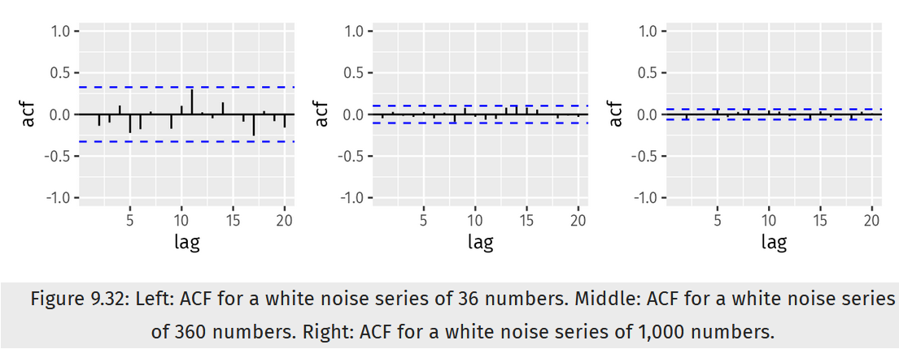

```{r, message=FALSE}
library(fpp3)
library(ggfortify)
library(forecast)
```

# Instructions

Do the exercises 9.1, 9.2, 9.3, 9.5, 9.6, 9.7, 9.8 in Hyndman.  Please submit both the Rpubs link as well as your .rmd file.


# 9.1

Figure 9.32 shows the ACFs for 36 random numbers, 360 random numbers and 1,000 random numbers.

## a.

Explain the differences among these figures. Do they all indicate that the data are white noise?



They differ in in range and all fall below the dashed lines. As the values lessens from about 0.25 and progressively lessen towards 0, the weaker the presence of autocorrelation. As the autocorrelation decreases, the more the values resemble white noise.

## b.

Why are the critical values at different distances from the mean of zero? Why are the autocorrelations different in each figure when they each refer to white noise?

They are at different distances because they are at different times or lengths of time $T$ which is approximated by the formula $\pm2\sqrt{T}$ ([ref](http://sfb649.wiwi.hu-berlin.de/fedc_homepage/xplore/tutorials/xegbohtmlnode39.html)) Meaning the critical values decrease as the length of time increases.

# 9.2.

A classic example of a non-stationary series are stock prices. Plot the daily closing prices for Amazon stock (contained in `gafa_stock`), along with the ACF and PACF. Explain how each plot shows that the series is non-stationary and should be differenced.

```{r}
unique(gafa_stock$Symbol)
```


```{r, warning=FALSE}
df_amzn<-gafa_stock%>%
         filter(Symbol=="AMZN")
ggplot(df_amzn, aes(x = Date, y = Close)) +
  geom_line(color = "blue") +
  labs(title = "Daily Closing Prices for Amazon Stock", x = "Date", y = "Closing Price") +
  theme_minimal()

df_amzn%>%
gg_tsdisplay(Close,plot_type = 'partial',)+
  labs(title="Partial Autocorrelation Funtion (PACF)")

df_amzn%>%
gg_tsdisplay(difference(Close),plot_type = 'partial')+
  labs(title="Partial Autocorrelation Funtion (PACF)")

```

* Closing Price plot shows an upward trend, plenty of variation but no real seasonality or cyclic behavior.
* ACF plot again shows no seasonality but it is slightly trending negatively.
* Differencing which would remove the changes in level, which could remove/reduce the trend and stabilize the mean.
* Differencing ACF plot supports that Amazon Closing price has no autocorrelation.


# 9.3.

For the following series, find an appropriate Box-Cox transformation and order of differencing in order to obtain stationary data.

## a.

Turkish GDP from `global_economy`.


```{r}
#filter out for turkey
df_turkey <- global_economy %>% 
  filter(Country=='Turkey') 

#find lambda value
lambda_turkey <- df_turkey %>%
  features(GDP, features = guerrero) %>%
  pull(lambda_guerrero)

#find ndiffs 
df_turkey  %>%
  mutate(GDP = box_cox(GDP, lambda_turkey)) %>%
  features(GDP, unitroot_ndiffs)

lambda_turkey
```

The best Box-Cox transformation is using a lambda of 0.1572187  or roughly 0.16. As far as differencing, the number of difference needed to obtain stationary data is 1. 


## b.

Accommodation takings in the state of Tasmania from aus_accommodation.

```{r message=FALSE, warning=FALSE}
df_tasmania <- aus_accommodation %>% 
  filter(State == 'Tasmania')

lambda_tasmania <- df_tasmania %>%
  features(Takings, features = guerrero) %>%
  pull(lambda_guerrero)

df_tasmania %>%
  mutate(Takings = box_cox(Takings, lambda_tasmania)) %>%
  features(Takings, unitroot_ndiffs) 

lambda_tasmania
```
The best lambda for the Box-cox transformation of `aus_accommodation` `Takings` for `Tasmania` is 0.001819643 or roughly 0.002, with the number of difference needed for stationary data being 1.

## c.

Monthly sales from souvenirs.

```{r message=FALSE, warning=FALSE}

lambda_souvenirs <- souvenirs %>% 
  features(Sales, features = guerrero) %>%
  pull(lambda_guerrero)

souvenirs %>%
  mutate(Sales = box_cox(Sales, lambda_souvenirs)) %>%
  features(Sales, unitroot_ndiffs)

lambda_souvenirs
```

The best lambda for the Box-cox transformation of Monthly sales from `souvenirs` is 0.002118221 or roughly 0.002, with the number of difference needed for stationary data being 1.

# 9.5

For your retail data (from Exercise 7 in Section [2.10](https://otexts.com/fpp3/graphics-exercises.html#graphics-exercises)), find the appropriate order of differencing (after transformation if necessary) to obtain stationary data.

```{r}
set.seed(1234)
myseries <- aus_retail |>
  filter(`Series ID` == sample(aus_retail$`Series ID`,1))
```

```{r}
myseries %>%
    gg_tsdisplay(Turnover, plot_type = 'partial', lag_max = 36) +
  labs(title= "Monthly Australian retail data | Turnover", y = NULL)
```


```{r, fig.height=9}
myseries %>% 
  transmute(
    `Turnover` = Turnover,
    `log(Turnover)` = log(Turnover),
    `log(Turnover) | Ann. Change` = difference(log(Turnover), 12),
        `DD log(Turnover)` =
                     difference(difference(log(Turnover), 12), 1)
  )%>%
  pivot_longer(-Month, names_to="Type", values_to="Turnover") %>%
  mutate(
    Type = factor(Type, levels = c(
      "Turnover",
      "log(Turnover)",
      "log(Turnover) | Ann. Change",
      "DD log(Turnover)"))
  ) %>%
  ggplot(aes(x = Month, y = Turnover)) +
  geom_line() +
  facet_grid(vars(Type), scales = "free_y") +
  labs(title= "Monthly Australian retail data | Turnover", y = NULL)
```

There clearly seems to be a increasing trend. It appears that there is a seasonal pattern for the series that increases in size, most notable for the spike in each level. Regardless it lack predictability for the stationary series. Log transformation stabilizes the data but maintians the increasing trend, while the seasonally differenced data of the log transformation was the most reasonably stabilized.

# 9.6

Simulate and plot some data from simple ARIMA models.

Use the following R code to generate data from an AR(1) model with $\emptyset_1=0.6$

and $\sigma^2=1$. The process starts with $y_1=0$.

```{r}
y <- numeric(100)
e <- rnorm(100)
for(i in 2:100)
  y[i] <- 0.6*y[i-1] + e[i]
sim <- tsibble(idx = seq_len(100), y = y, index = idx)
```

```{r}
head(sim)
```


## b.

Produce a time plot for the series. How does the plot change as you change $\phi_1$?

```{r}

sim %>% autoplot(y) +
  labs(title = expression("AR(1) model with" ~ phi[1] ~ "=" ~ 0.6 ~ "," ~ sigma^2 ~ "=" ~ 1 ~ "," ~ y[1] ~ "=" ~ 0))

```

```{r}

for(i in 2:100)
  y[i] <- .8*y[i-1] + e[i]
sim1 <- tsibble(idx = seq_len(100), y = y, index = idx)

for(i in 2:100)
  y[i] <- 0.2*y[i-1] + e[i]
sim2 <- tsibble(idx = seq_len(100), y = y, index = idx)

for(i in 2:100)
  y[i] <- -1.0*y[i-1] + e[i]
sim3 <- tsibble(idx = seq_len(100), y = y, index = idx)

for(i in 2:100)
  y[i] <- 1.4*y[i-1] + e[i]
sim4 <- tsibble(idx = seq_len(100), y = y, index = idx)


plt1 <- sim1 %>% autoplot(y) +
 labs(title = expression("AR(1) model with" ~ phi[1] ~ "=" ~ 0.8 ~ "," ~ sigma^2 ~ "=" ~ 1 ))
plt2 <- sim2 %>% autoplot(y) +
  labs(title = expression("AR(1) model with" ~ phi[1] ~ "=" ~ 0.2 ~ "," ~ sigma^2 ~ "=" ~ 1 ))
plt3 <- sim3 %>% autoplot(y) +
  labs(title = expression("AR(1) model with" ~ phi[1] ~ "=" ~ -1.0 ~ "," ~ sigma^2 ~ "=" ~ 1 ))
plt4 <- sim4 %>% autoplot(y) +
  labs(title = expression("AR(1) model with" ~ phi[1] ~ "=" ~ 1.4 ~ "," ~ sigma^2 ~ "=" ~ 1 ))


gridExtra::grid.arrange(plt1, plt2, plt3, plt4, ncol = 2, nrow = 2)
```

As $\phi_{1}$ increases or decrease, the magnitude and wavelength matches  $\phi_{1}$ increasing and decreasing in the same direction. This is also true for the magnitude and wavelength for values between 0 and 1, but for $\phi$ values greater than 1 the plot emulates an exponential function $f(x)=a^x$, while wavelength shortens for values less than 0, meaning a higher frequency with varying amplitudes.


## c.

Write your own code to generate data from an MA(1) model with $\theta_1$=0.6
and $\sigma^2=1$.

```{r}
# Reference
# y <- numeric(100)
# e <- rnorm(100)
# for(i in 2:100)
#   y[i] <- 0.6*y[i-1] + e[i]
# sim <- tsibble(idx = seq_len(100), y = y, index = idx)
```


```{r}
for(i in 2:100)
  y[i] <- 0.6*e[i-1] + e[i] 

sim_ma <- tsibble(idx = seq_len(100), y = y, index = idx)
```

## d.

Produce a time plot for the series. How does the plot change as you change $\theta_1$?

```{r}
sim_ma %>% autoplot(y)+
  labs(title = expression("AR(1) model with" ~ phi[1] ~ "=" ~ 0.6 ~ "," ~ sigma^2 ~ "=" ~ 1))
```

```{r}
#create the data
for(i in 2:100)
  y[i] <- 0*e[i-1] + e[i] 
sim1_ma <- tsibble(idx = seq_len(100), y = y, index = idx)

for(i in 2:100)
  y[i] <- .8*e[i-1] + e[i] 
sim2_ma <- tsibble(idx = seq_len(100), y = y, index = idx)

for(i in 2:100)
  y[i] <- -1.4*e[i-1] + e[i] 
sim3_ma<- tsibble(idx = seq_len(100), y = y, index = idx)

for(i in 2:100)
  y[i] <- 1.5*e[i-1] + e[i] 
sim4_ma<- tsibble(idx = seq_len(100), y = y, index = idx)

#create the ggplot objects
plt5 <- sim1_ma %>% autoplot(y)+
  labs(title = expression("MA(1) model with" ~ phi[1] ~ "=" ~ 0 ~ "," ~ sigma^2 ~ "=" ~ 1))


plt6 <- sim2_ma %>% autoplot(y)+
  labs(title = expression("MA(1) model with" ~ phi[1] ~ "=" ~ 0.8 ~ "," ~ sigma^2 ~ "=" ~ 1))

plt7 <- sim3_ma %>% autoplot(y)+
  labs(title = expression("MA(1) model with" ~ phi[1] ~ "=" ~ -1.4 ~ "," ~ sigma^2 ~ "=" ~ 1))

plt8 <- sim4_ma %>% autoplot(y)+
  labs(title = expression("MA(1) model with" ~ phi[1] ~ "=" ~ 1.5 ~ "," ~ sigma^2 ~ "=" ~ 1))

#plot them all togther
gridExtra::grid.arrange(plt5, plt6, plt7, plt8, ncol = 2, nrow = 2)
```

As $\theta$ changes, the plots barely change to be honest.They all show a steady variance and implying the MA(1) series are stationary. Amplitude minimum and maximum hardly changes as well and there are no shifts in wavelengths.


## e. 

Generate data from an ARMA(1,1) model with $\phi_1=0.6$, $\theta_1=0.6$ and $\sigma^2=1$

```{r message=FALSE, warning=FALSE, class.source = 'fold-show'}
for(i in 2:100)
  y[i] <- 0.6*y[i-1] + 0.6*e[i-1] + e[i]

sim_arma11 <- tsibble(idx = seq_len(100), y = y, index = idx)
```

## f.

Generate data from an AR(2) model with $\phi_1=−0.8$, $\phi_2=0.3$ and $\sigma^2=1$. (Note that these parameters will give a non-stationary series.)

```{r}
phi_1<--0.8
phi_2<-0.3


for(i in 3:100)
  y[i] <- -phi_1*y[i-1] + phi_2*y[i-2] + e[i]

sim_ar_8_3 <- tsibble(idx = seq_len(100), y = y, index = idx)
```


## g.

Graph the latter two series and compare them.

```{r}
plt9 <- sim_arma11 %>% autoplot(y)+
  labs(title = expression("ARMA(1,1) model with" ~ phi[1] ~ "=" ~ 0.6 ~ "," ~ theta[1] ~ "=" ~ 0.6 ~ "," ~ sigma^2 ~ "=" ~ 1))

plt10 <- sim_ar_8_3 %>% autoplot(y)+
  labs(title = expression("ARMA model with" ~ phi[1] ~ "=" ~ -0.8 ~ "," ~ theta[1] ~ "=" ~ 0.3 ~ "," ~ sigma^2 ~ "=" ~ 1))

gridExtra::grid.arrange(plt9, plt10, ncol = 1, nrow = 2)
```

Arma(1,1) model has a plot that does not show seasonality or trend, with a maximum of 3 and minimum of -6, while the 2nd ARMA model emulates a exponential fucntion as noted in a previous example.

# 9.7

Consider aus_airpassengers, the total number of passengers (in millions) from Australian air carriers for the period 1970-2011.

```{r}
max(aus_airpassengers$Year)

```

```{r}
min(aus_airpassengers$Year)
```

```{r}
head(aus_airpassengers)
```


## a.

Use ARIMA() to find an appropriate ARIMA model. What model was selected. Check that the residuals look like white noise. Plot forecasts for the next 10 periods.

```{r}
aus_air_pd_71_11<-aus_airpassengers %>%
  filter(Year>=1971&Year<=2011)

fit_aus <- aus_air_pd_71_11%>%
  model(ARIMA(Passengers))

#find the fit
report(fit_aus)
```

```{r}
#forecast 10 periods
fit_aus %>% forecast(h=10) %>%
  autoplot(aus_airpassengers) +
  labs(y = "Passengers (Millions)", 
       title = "Australian Air Passengers (1971-2011)",
       subtitle = "10 Year Forecast")
```


```{r}
fit_aus %>% gg_tsresiduals() + 
  labs(title = "Australian Air Passengers (1971-2011)",
       subtitle = "Australian Air Passengers (1971-2011)")
```

Function `ARIMA()` automatically selected for `aus_airpassengers` data model, which was an ARIMA(0,2,1). Function `gg_tsresiduals()` confirms there is white noise base on the residuals.


## b.

Write the model in terms of the backshift operator.

$y_t = -0.8963 * \epsilon_{t-1} + \epsilon_{t}$

## c.

Plot forecasts from an ARIMA(0,1,0) model with drift and compare these to part a.

```{r}
fit_aus_010 <- aus_air_pd_71_11 %>%
  model(ARIMA(Passengers ~ pdq(0,1,0)))

report(fit_aus_010)
```


```{r}

#plot forecast
fit_aus_010 %>% forecast(h=10) %>%
  autoplot(aus_air_pd_71_11) +
  labs(y = "Passengers (Millions", 
       title = "Australian Air Passengers (1971-2011)",
       subtitle = "10 Year Forecast")

#plot residuals
fit_aus_010 %>% gg_tsresiduals() +
  labs(title = "Australian Air Passengers (1971-2011)",
       subtitle = "10 Year Forecast")
```

Part A forecasts higher, and part C residuals show white noise.

## d.

Plot forecasts from an ARIMA(2,1,2) model with drift and compare these to parts a and c. Remove the constant and see what happens.

```{r}
fit_aus212 <- aus_air_pd_71_11 %>%
  model(ARIMA(Passengers ~ pdq(2,1,2)))

```

```{r}
fit_aus212_no_const <- aus_airpassengers %>%
  model(ARIMA(Passengers ~ pdq(2,1,2),include.constant=FALSE)) 
```


```{r}
report(fit_aus212)
```


```{r}
#plot forecast
fit_aus212 %>% forecast(h=10) %>%
  autoplot(aus_air_pd_71_11) +
  labs(y = "Passengers (Millions", 
       title = "Australian Air Passengers (1971-2011)",
       subtitle = "10 Year Forecast")

#plot residuals
fit_aus212 %>% gg_tsresiduals() +
  labs(title = "Australian Air Passengers (1971-2011)",
       subtitle = "10 Year Forecast")
```

This model compared to part a and b seems worse and has white noise. Removing the constant produced an error.

## e.

Plot forecasts from an ARIMA(0,2,1) model with a constant. What happens?

section 9.7 a does this already. It is the best fitting model.

# 9.8

For the United States GDP series (from global_economy):

```{r}
df_us<-global_economy%>%
        filter(Country =="United States")
```


## a.

if necessary, find a suitable Box-Cox transformation for the data;

```{r}

df_us %>% autoplot(GDP) +
  labs(title = "US GDP")
```

No need for a transformation, the data doesn't vary.

## b.

fit a suitable ARIMA model to the transformed data using ARIMA();

```{r}
fit_us <- df_us %>%
  model(
    arima = ARIMA(GDP, stepwise = FALSE, approx = FALSE))

report(fit_us)
```

Model: ARIMA(0,2,2) according to ARIMA()

## c.

try some other plausible models by experimenting with the orders chosen;

```{r}
df_us %>%
  features(GDP, unitroot_ndiffs)

df_us %>%
  gg_tsdisplay(GDP, plot_type = 'partial')

fit_us222 <- df_us %>%
  model(ARIMA(GDP ~ pdq(2,2,2)))

fit_us112 <- df_us %>%
  model(ARIMA(GDP ~ pdq(1,1,2)))

fit_us211 <- df_us %>%
  model(ARIMA(GDP ~ pdq(2,1,1)))

fit_us221 <- df_us %>%
  model(ARIMA(GDP ~ pdq(2,2,1)))

report(fit_us222)
report(fit_us112)
report(fit_us211)
report(fit_us221)
```

- AIC, AICc, and BIC values increase when increasing q value from 2 to 1.
- AIC, AICc, and BIC values decreased when decreasing q values.
- 2,2,2 is the best fit from the combinations.


## d.

choose what you think is the best model and check the residual diagnostics;

ARIMA(2,2,2) - But the ACF looks like white noise and residuals is left skewed

```{r}
fit_us222 %>% gg_tsresiduals() +
  labs(title = "ARIMA(2,2,2)")
```


## e.

produce forecasts of your fitted model. Do the forecasts look reasonable?

```{r}
fit_us222 %>% forecast(h=10) %>%
  autoplot(df_us) +
  labs(title = "ARIMA(2,2,2)")
```

Pretty much reasonable base on what our previous data showed.

## f.

compare the results with what you would obtain using ETS() (with no transformation).

```{r}
fit_ets <- df_us %>% 
  model(ETS(GDP))

report(fit_ets)
```

```{r}
fit_ets %>% forecast(h = 10) %>%
  autoplot(df_us) 
```

```{r}
fit_ets %>% gg_tsresiduals()
```


The comparison for ARIMA(2,2,2) AICc=3053.47  vs. ETS(M,A,N) AICc=3191.941, ARIMA(2,2,2) performs better and forecasts are good for both considering the ACF plots lack correlation.

